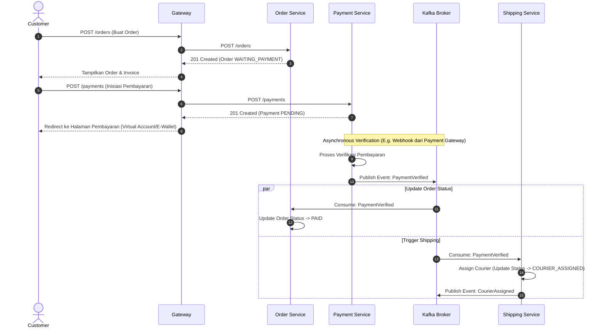

# API Specification

## 1. Tujuan
Dokumen ini memuat spesifikasi API utama untuk layanan Papiton Express.

## 2. Gateway

### Auth
- POST /auth/register
- POST /auth/login
- POST /auth/refresh

### Order
- POST /orders
- GET /orders/{id}
- GET /orders
- POST /orders/{id}/complete (Konfirmasi order selesai oleh customer)

### Payment
- POST /payments (Inisiasi pembayaran)
- GET /payments/{id}
- POST /payments/webhook (Callback otomatis dari Payment Gateway)
- POST /payments/{id}/verify (Verifikasi manual oleh admin)

### Shipping
- POST /shipments (Pembuatan shipment & assign kurir otomatis)
- POST /shipments/{id}/assign-override (Override penugasan kurir manual oleh admin)
- PUT /shipments/{id}/status (Update status kurir: picked up, delivered, dll)
- GET /shipments/{id}

### Warehouse
- POST /warehouse/packages/receive (Paket masuk gudang)
- POST /warehouse/packages/sort (Proses sorting paket)
- POST /warehouse/packages/dispatch (Paket keluar gudang menuju lokasi berikutnya/penerima)
- GET /warehouse/packages/{orderId}

### Tracking
- GET /tracking/{orderId}
- GET /tracking/{orderId}/timeline

### Notification
- POST /notifications/test

## 3. Contoh Payload

### Create Order
```json
{
  "customerId": "550e8400-e29b-41d4-a716-446655440000",
  "serviceTypeId": "550e8400-e29b-41d4-a716-446655440001",
  "weight": 2.50,
  "length": 30.00,
  "width": 20.00,
  "height": 10.00,
  "sender": {
    "name": "Budi",
    "phone": "081234567890",
    "address": "Jl. Merdeka No. 10",
    "city": "Jakarta",
    "province": "DKI Jakarta",
    "postalCode": "10110"
  },
  "receiver": {
    "name": "Sari",
    "phone": "081298765432",
    "address": "Jl. Dago No. 15",
    "city": "Bandung",
    "province": "Jawa Barat",
    "postalCode": "40111"
  }
}
```

### Create Payment
```json
{
  "orderId": "550e8400-e29b-41d4-a716-446655440002",
  "amount": 25000.00,
  "paymentMethod": "bank_transfer"
}
```

## 4. Status Order
```text
WAITING_PAYMENT ➔ PAID ➔ COURIER_ASSIGNED ➔ PICKED_UP ➔ WAREHOUSE_IN ➔ IN_DELIVERY ➔ DELIVERED ➔ COMPLETED
```
*Catatan: Transisi status dari `WAREHOUSE_IN` ke `IN_DELIVERY` dipicu oleh event `WarehouseOut` (paket keluar gudang).*

## 5. Diagram Alur Order (Asynchronous Event-Driven)

