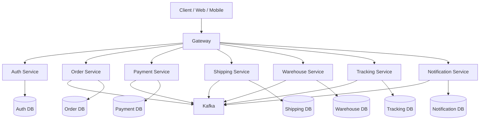

# Architecture

## 1. Arsitektur Sistem
Papiton Express menggunakan arsitektur microservice dengan gateway sebagai titik masuk, auth service untuk keamanan, dan layanan domain untuk order, payment, shipping, warehouse, tracking, dan notification.

## 2. Komponen Utama
- Gateway
- Auth Service
- Order Service
- Payment Service
- Shipping Service
- Warehouse Service
- Tracking Service
- Notification Service
- Kafka
- PostgreSQL per service

## 3. Diagram Arsitektur

## 4. Prinsip Desain
- **Database per Service:** Setiap layanan memiliki database PostgreSQL sendiri untuk menjamin pemisahan data yang ketat.
- **Komunikasi Event-Driven:** Komunikasi alur bisnis utama antar-layanan bersifat asinkron melalui event bus (Kafka). REST API hanya digunakan untuk entry point client via Gateway, manual override/admin actions, dan querying data.
- **Asynchronous Status Sync:** Order Service bertindak sebagai consumer untuk event dari layanan lain (Payment, Shipping, Warehouse) guna memperbarui status order secara asinkron (mengeliminasi sinkronisasi status via REST API).
- **Transactional Outbox Pattern:** Setiap service mengimplementasikan Outbox Pattern untuk memastikan event bisnis disimpan secara transaksional di database lokal sebelum dipublikasikan ke Kafka.
- **Auth Gatekeeping:** Auth Service menjadi otoritas utama otentikasi (JWT) di level Gateway sebelum request diteruskan ke layanan domain.
- **Consumer Only Services:** Tracking Service dan Notification Service murni bertindak sebagai consumer event dan tidak mempublikasikan event baru ke Kafka.

