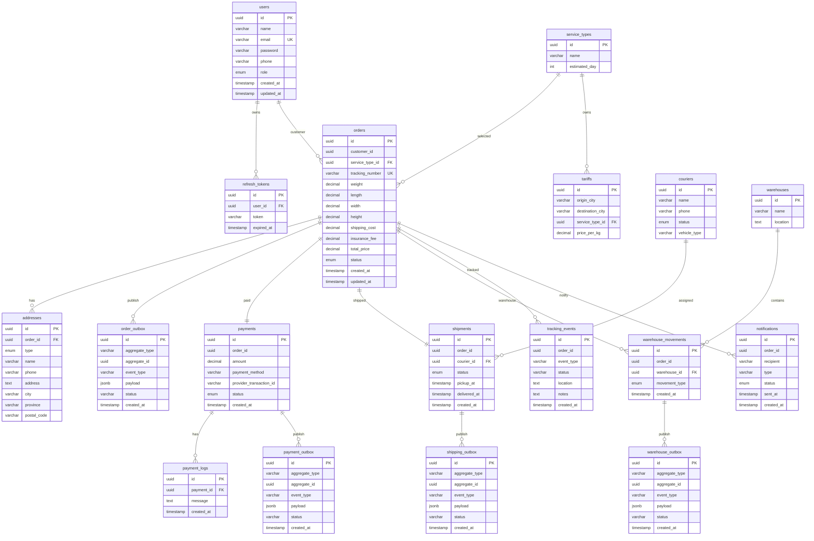

# Entity Relationship Diagram (ERD): Papiton Express

Karena Papiton Express menggunakan arsitektur **Database-per-Service** (setiap microservice memiliki database PostgreSQL-nya sendiri), secara fisik **tidak ada Foreign Key (FK) lintas database**. 

Hubungan data antar-layanan terikat secara **logis** melalui *shared identifiers* (seperti `order_id` atau `user_id`) yang disinkronkan melalui event Kafka.

Berikut adalah visualisasi ERD lengkap untuk seluruh layanan Papiton Express:

---

## Deskripsi Relasi & Atribut Kunci

### 1. Pola Hubungan Outbox (`outbox_events` / `_outbox`)
Setiap DB operasional memiliki tabel outbox lokal. Struktur tabel ini seragam di seluruh service. Relasinya adalah **1-to-Many** antara entitas utama (seperti `orders` atau `payments`) dengan tabel outbox-nya. Ketika entitas utama dibuat atau statusnya berubah, baris baru ditambahkan ke tabel outbox dalam transaksi DB yang sama.

### 2. Logika Relasi Antar-Layanan
* **`orders.customer_id` ➔ `users.id`**: Relasi logis. Order Service tidak memvalidasi FK ke Auth DB secara langsung, tetapi API Gateway memastikan token JWT yang digunakan berisi `userID` yang valid milik customer.
* **`payments.order_id` ➔ `orders.id`**: Relasi logis. Saat Order dibuat, detail order dikirim melalui Kafka, lalu Payment Service merekam tagihan untuk `order_id` tersebut.
* **`shipments.courier_id` ➔ `couriers.id`**: Relasi fisik lokal (FK) di dalam Shipping Database.
* **`warehouse_movements.warehouse_id` ➔ `warehouses.id`**: Relasi fisik lokal (FK) di dalam Warehouse Database.
* **`tracking_events.order_id` ➔ `orders.id`**: Relasi logis. Tracking Service mengumpulkan seluruh event status dari berbagai service dan menampilkannya sebagai *historical timeline* untuk satu `order_id`.
