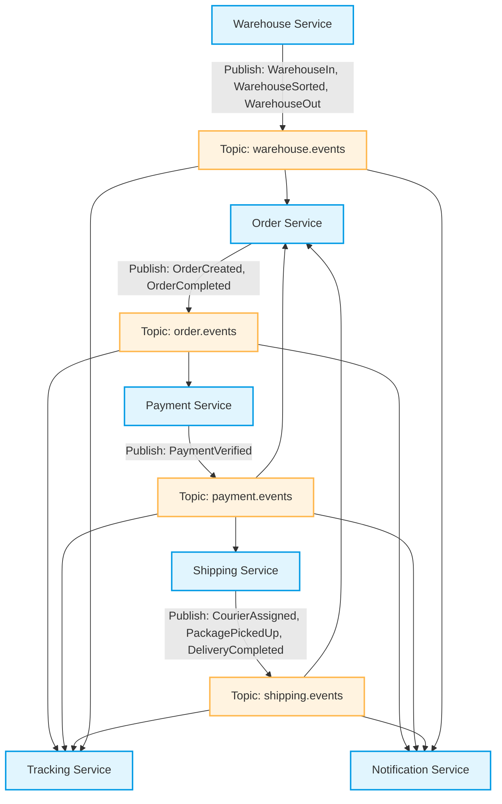

# Event Flow

## 1. Prinsip
Tracking dan Notification adalah consumer utama untuk event eksternal. Namun, Order Service juga bertindak sebagai consumer untuk event dari layanan lain guna melakukan pembaruan status order secara asinkron.

## 2. Event Utama
| Event | Publisher | Consumer |
|------|-----------|----------|
| OrderCreated | Order Service | Payment Service, Tracking Service, Notification Service |
| PaymentVerified | Payment Service | Shipping Service, Order Service, Tracking Service, Notification Service |
| CourierAssigned | Shipping Service | Order Service, Tracking Service, Notification Service |
| PackagePickedUp | Shipping Service | Order Service, Tracking Service, Notification Service |
| WarehouseIn | Warehouse Service | Order Service, Tracking Service |
| WarehouseSorted | Warehouse Service | Tracking Service |
| WarehouseOut | Warehouse Service | Order Service, Tracking Service, Notification Service |
| DeliveryCompleted | Shipping Service | Order Service, Tracking Service, Notification Service |
| OrderCompleted | Order Service | Tracking Service, Notification Service |

## 3. Topic Kafka
- order.events (OrderCreated, OrderCompleted)
- payment.events (PaymentVerified)
- shipping.events (CourierAssigned, PackagePickedUp, DeliveryCompleted)
- warehouse.events (WarehouseIn, WarehouseSorted, WarehouseOut)

## 4. Alur Event

